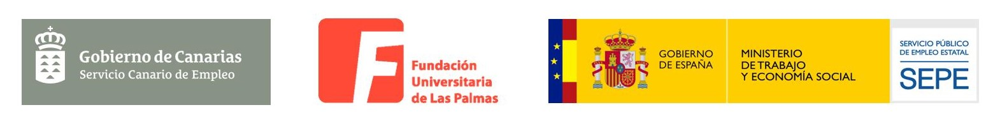

Practica de Node.js (18.17.1) para crear un CRUD con Mysql.

**Alumna:** (insertar nombre)\
**PFAE Skills Up:** Comunidad Online para la mejora de la tu empleabilidad.\
**Entidad:** Fundación Universitaria de Las Palmas de Gran Canaria.

Proyecto para examen de fullstack . FULP-PFAE Skills UP
Mi proyecto se llama Socka Players, trata de un juego en el cual tienes que registrarte rellenando un formulario, con nombre, apellido, posición, número, nombre de ususario, los cuales puedes eliminar o editar, para que funcione debes de abrir el XAMPP y activar el apche y MYSQL.
